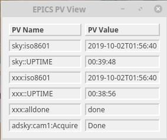

# pvview

Display one or more EPICS PVs in a PyDM GUI window as a table.

## Example

```
pvview {sky,xxx}:{iso8601,:UPTIME} xxx:alldone adsky:cam1:Acquire &
```



## Install

```bash
pip install pvview
```

### Install with conda (recommended)

Use conda to create an isolated Python environment, then pip for everything else:

```bash
conda create -n pvview python=3.14 pvview
```

### Install with pip

Use conda to create an isolated Python environment, then pip for everything else:

```bash
pip install pvview
```

### Install from source (developer)

```bash
git clone https://github.com/BCDA-APS/pvview.git
cd pvview
conda create -n pvview python=3.14
conda activate pvview
pip install -e .[dev]
```
